# DESCRIPTION
# Cryptic Combat Project Documentation

## 1 Project Overview

### Project Name
**Cryptic Combat**

### Brief Description
Cryptic Combat is a word-combat roguelike built with Python and Pygame  
The game combines real-time overworld exploration with battle encounters where players solve 5-letter words to deal damage and build combo momentum

Players move across connected realms, interact with statues, fight myth-themed enemies, and manage resources such as HP, items, and rewards  
The project also includes gameplay statistics logging and in-game data visualization for performance review and balancing

### Problem Statement
Traditional word games usually focus on puzzle solving without strategic combat pressure  
Traditional combat games usually do not use language skill as a core gameplay mechanic

This project addresses both gaps by turning word solving into a direct combat system where speed, accuracy, and consistency affect survival and progression

### Target Users
- Players who enjoy puzzle and action hybrid games
- Players interested in word games with higher gameplay tension
- Roguelike players who prefer short loops with clear progression
- Students and developers who want a data-driven game project example

### Key Features
- Real-time overworld exploration with multi-realm traversal
- Word-based combat with `GREEN YELLOW GRAY` feedback
- Combo-based damage scaling
- Enemy tier progression with `Follower Zealot Apostle Boss`
- Inventory and consumable items such as `Health Potion Hint Scroll Warp Scroll`
- Save slots and persistent progress
- Gameplay statistics logging to CSV
- In-game statistics dashboard and chart visualization

### Screenshots
**Gameplay**

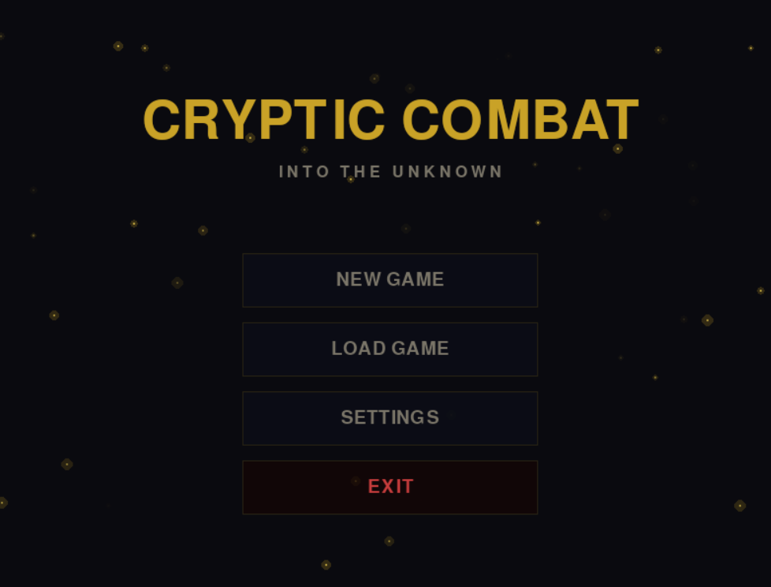
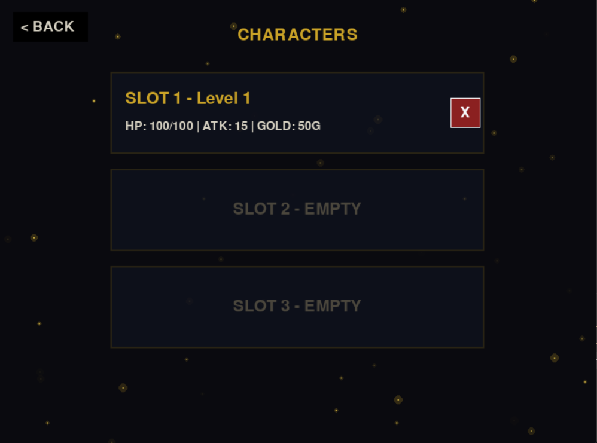
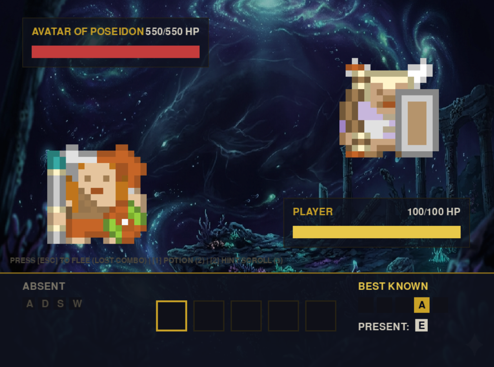
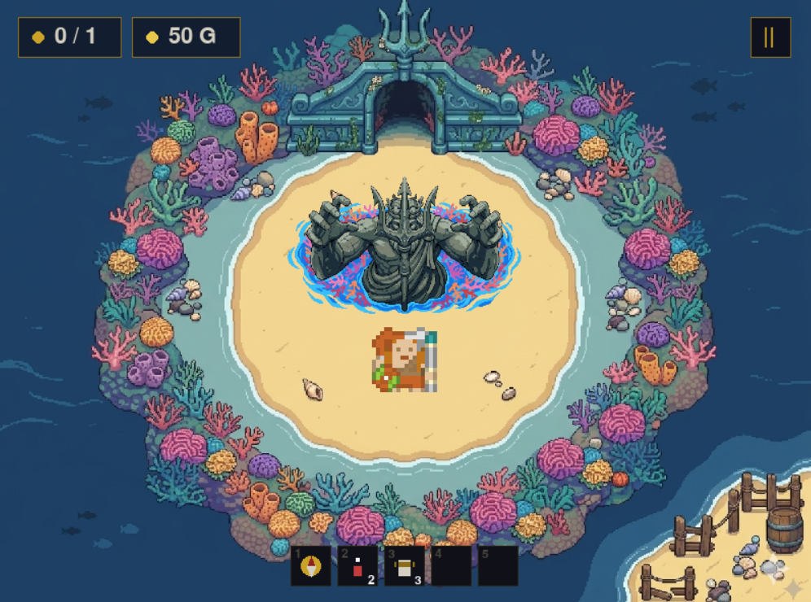
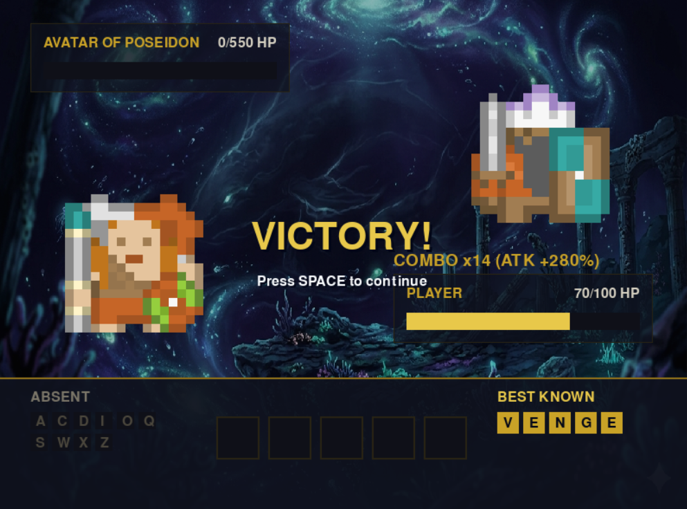
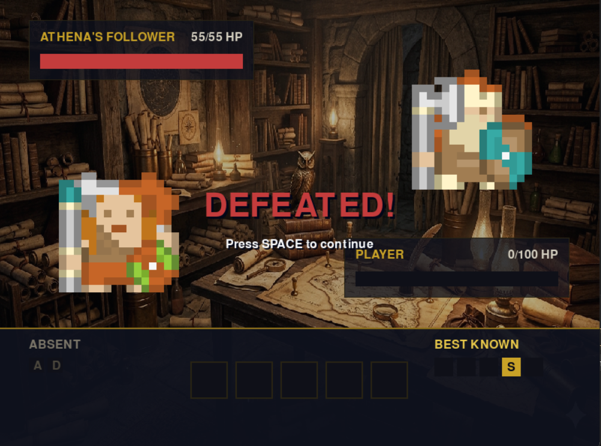
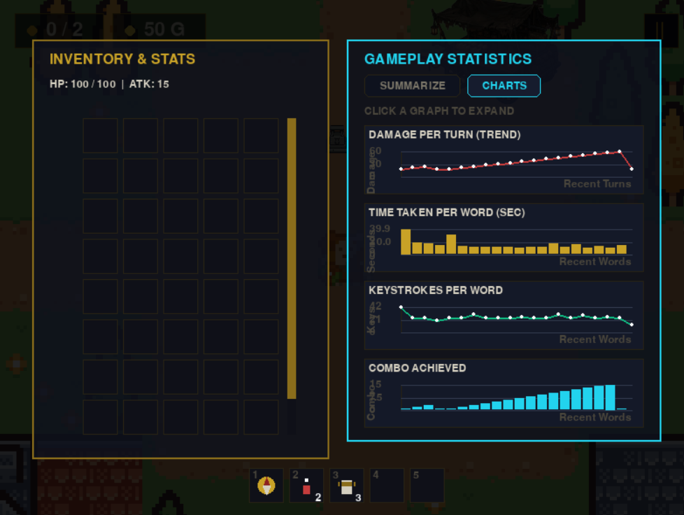
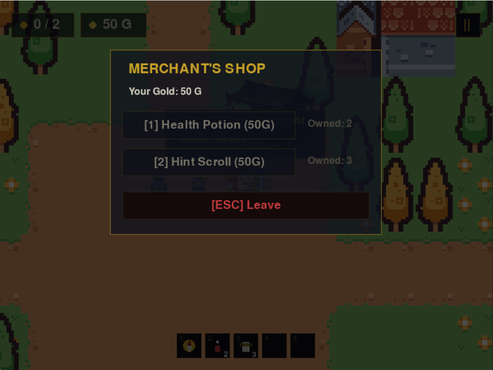

**Data Overview**

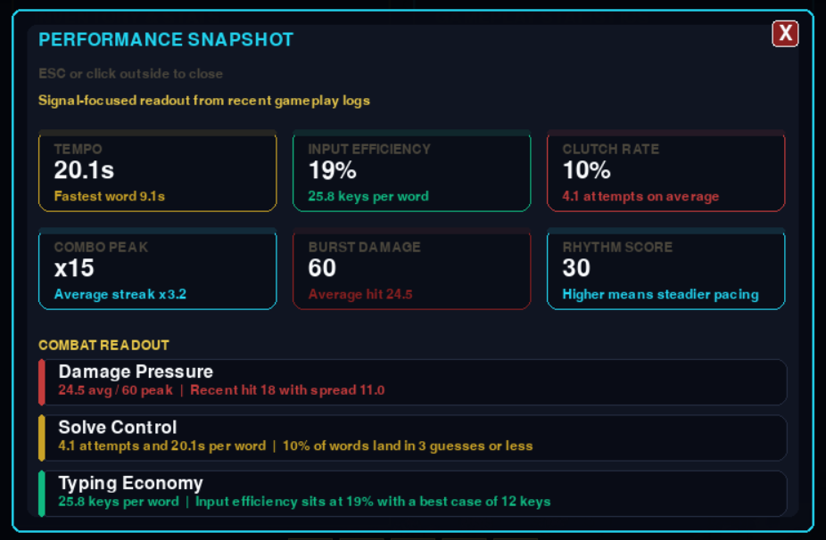
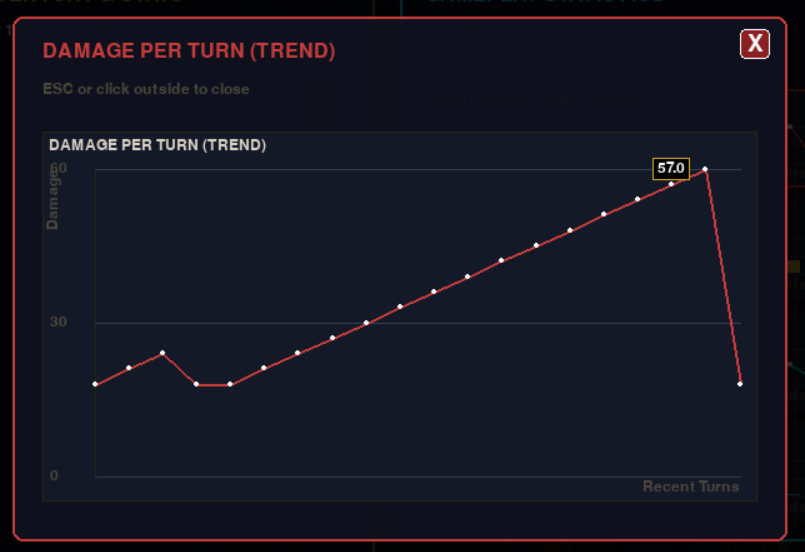
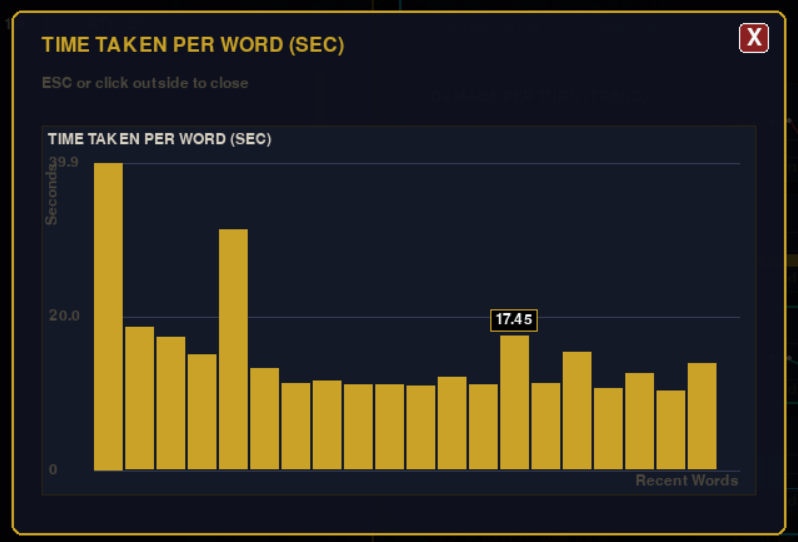
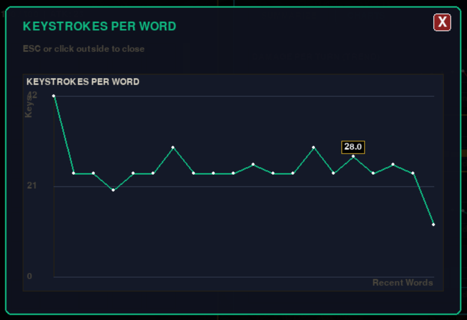
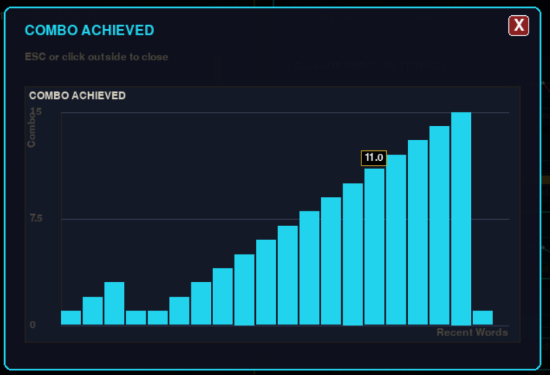
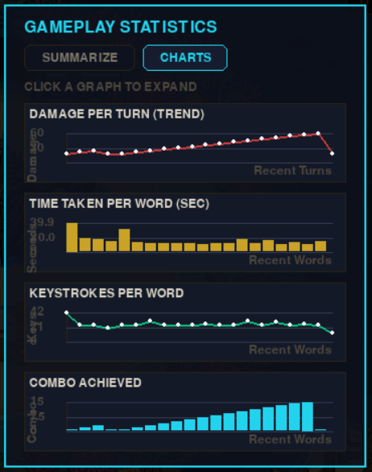

### Proposal
[Project Proposal PDF](./cryptic-combat-project-proposal.pdf)

### YouTube Link
**Status Unfinished**  
The final presentation link is not attached yet  
The target video length is about 7 minutes and should cover application demo, class design explanation, and statistics or data visualization explanation

---

## 2 Concept

### 2 1 Background
The project was created to combine language skill with high-stakes combat decisions in one gameplay loop  
Word puzzle games often provide cognitive challenge but limited strategic pressure  
Combat games often provide pressure but rarely make language processing the core mechanic

Cryptic Combat merges both directions by making each solved word affect combo growth and damage output  
This design creates measurable player signals such as solve time, attempts, keystrokes, combo, and damage that can be analyzed for balancing

### 2 2 Objectives
- Build a smooth gameplay loop between overworld exploration and word combat
- Ensure word solving quality has direct gameplay impact
- Create clear progression through enemy tiers and realm structure
- Apply object-oriented design for maintainability and extensibility
- Record gameplay data continuously and visualize it clearly
- Provide documentation that maps directly to the actual codebase

---

## 3 UML Class Diagram

### Diagram Attachment
[UML Class Diagram PDF](./diagram_uml.pdf)

### 3 1 Classes
- `PygameApp`
- `AppSetupMixin`
- `EventHandlerMixin`
- `MenuRenderMixin`
- `StateRenderMixin`
- `WorldGameplayMixin`
- `SaveDataMixin`
- `StatsInventoryMixin`
- `Player`
- `Enemy`
- `Boss`
- `GameManager`
- `WordDictionary`
- `TileBoard`
- `GameMap`
- `MapObject`
- `TileType`
- `SpriteSheet`
- `MapEditor`

### 3 2 Attributes
- `PygameApp` includes `state screen_width screen_height inventory stats_data game_map`
- `Player` includes `hp base_attack combo_count`
- `Enemy` includes `name max_hp current_hp attack_power`
- `Boss` includes `special_attack_charge enrage_threshold`
- `GameManager` includes `word_start_time time_taken keystroke_count gameplay_data csv_filename`
- `WordDictionary` includes `difficulty_level word_data_list current_hint`
- `TileBoard` includes `grid_size current_attempt`
- `GameMap` includes `realm_x realm_y level grid objects spawn_point`
- `MapObject` includes `x y type data collected rect`

### 3 3 Methods
- `PygameApp.run` controls the main loop and state dispatch
- `WorldGameplayMixin.submit_guess` validates guesses, applies combat results, and records data
- `SaveDataMixin.save_game_data` and `SaveDataMixin.load_game_data` manage persistence
- `StatsInventoryMixin.draw_*` renders charts and summary dashboard
- `GameManager.start_word_timer end_word_timer record_word_data export_data_to_csv`
- `WordDictionary.generate_random_word get_current_hint`
- `TileBoard.evaluate_colors`
- `GameMap.load_map save_map draw check_collision_at`

### 3 4 Relationships
- **Inheritance** `Boss` extends `Enemy`
- **Composition** `PygameApp` owns `GameManager WordDictionary TileBoard GameMap` and active entities
- **Aggregation** `GameMap` contains multiple `MapObject` instances
- **Dependency** gameplay mixins depend on `Player Enemy GameManager TileBoard`
- **Data Flow** `GameManager` writes CSV and `StatsInventoryMixin` reads CSV for visualization

---

## 4 Object-Oriented Programming Implementation

### Application Layer
- `PygameApp` central controller for game loop and state transitions
- `AppSetupMixin` asset setup and initial configuration
- `EventHandlerMixin` keyboard and mouse event routing
- `MenuRenderMixin` menu rendering logic
- `StateRenderMixin` rendering per game state
- `WorldGameplayMixin` overworld movement, interaction flow, and combat logic
- `SaveDataMixin` save slot and persistence logic
- `StatsInventoryMixin` statistics UI and chart rendering

### Domain Layer
- `Player` player stats and damage calculation logic
- `Enemy` base enemy behavior and damage handling
- `Boss` extended enemy behavior with special attack logic
- `GameManager` combat timing, win checks, and data logging

### Mechanics and Data Layer
- `WordDictionary` word loading and hint handling
- `TileBoard` guess evaluation and attempt progression
- `GameMap` map load or generate, collision checks, and drawing
- `MapObject` map entity structure for interactables and environment objects
- `TileType` tile category constants
- `SpriteSheet` sprite extraction and composition helper

### Tooling Layer
- `MapEditor` map authoring and editing utility

---

## 5 Statistical Data

### 5 1 Data Recording Method
Statistical recording is handled by `GameManager` during battle flow
- `start_word_timer` starts timing when a new word begins
- `end_word_timer` stops timing when a word is solved
- `record_word_data` stores one combat-word record in memory
- `export_data_to_csv` appends buffered records to CSV

Primary dataset path
- `data/raw/gameplay_stats.csv`

Storage characteristics
- Fixed CSV schema
- Append mode for multi-session accumulation
- No overwrite of previous records

### 5 2 Data Features

| Feature | Type | Description | Usage |
|---|---|---|---|
| `time_taken_per_word` | float | Time used to solve each word in seconds | Tempo and pacing analysis |
| `attempts_per_word` | int | Number of attempts used before correct answer | Accuracy analysis |
| `combo_achieved` | int | Combo value when the word is solved | Momentum analysis |
| `damage_per_turn` | int | Damage dealt on that solved turn | Combat effectiveness analysis |
| `keystrokes_per_word` | int | Total key inputs used per solved word | Input efficiency analysis |

Related visualization document
- [Visualization Documentation](./screenshots/visualization/VISUALIZATION.md)

---

## 6 Additional Sections

### 6 1 Changed Proposed Features
- Architecture was refactored into a mixin-based application structure for clearer responsibility boundaries
- In-game statistics and dashboards were expanded for immediate player feedback
- Save slot and persistence workflows were strengthened for longer progression runs

Reasons for these changes
- Better maintainability and feature extensibility
- Better balancing support from real gameplay data
- Better production readiness and user experience

### 6 2 External Sources
- Visual assets from `Gemini Kenny nl MidJourney`
- Sound and music assets from `Suno ai`
